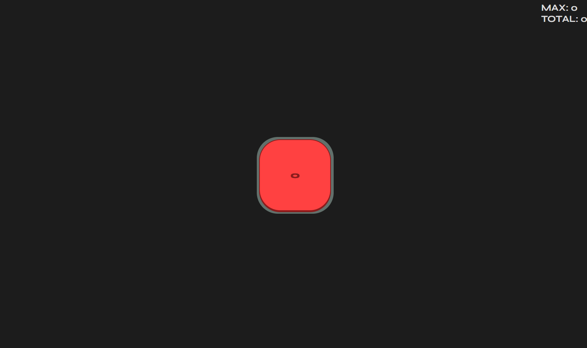

# The Button

This project is bases on a Steam game [THE BUTTON by Elendow](https://store.steampowered.com/app/1999740/THE_BUTTON_by_Elendow/)
It consists of simply clicking a button, that simple, but with each click, the chance of losing increases!

Objective: Get the maximum number of points without giving up!

You can play it [Here](https://brundevcoder.github.io/button/)

## How to Play?

That's simple! You just need to click the button, just like that! But... Depending on how many points you already have, the higher the chance of losing!

## Design

- Fonts used in this project: `Syne`. From [Google Fonts](https://fonts.google.com/specimen/Syne)
- About the colors: This project has very few colors! Only the red of the button to be eye-catching `#FF4141`, the button background `#62706B`, and finally the page background `#1C1C1C`

## QA

### Can I customize the button?
- Yes, you can! Just click the "Settings" button at the bottom of the screen and select the theme you want!

### Can I click somewhere else on the screen to count?
- Yes! Just click any key, it could be the mouse, a random key, or even just the game's background!

### What are the values at the top of the screen?

- They are just the counters!
Here's a more detailed explanation:

> `MAX`: count what your highest score was!
> `TOTAL`: Keep track of how many clicks you've already made on the button.
> `RESETS`: It only counts the number of times you returned to 0.